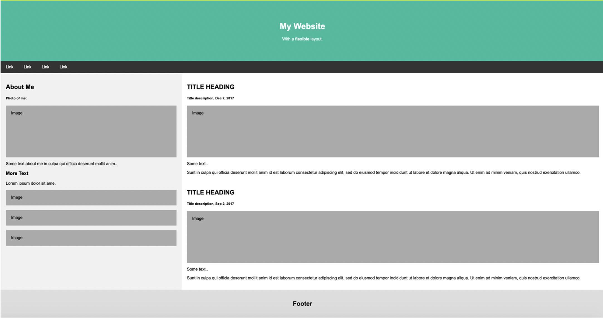

# **Front-End Day 1 Exercises**

> ## LearnYouHtml - basic Html exercise
* Finish 11 exercises
* Status: Complete

> ## Portfolio Webpage 
* Create a webpage as given in template:  

* Status: Complete. (As shown below):

> ## Shop Webpage
* 